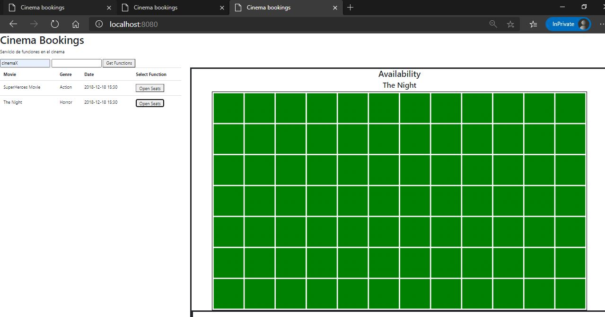

# Laboratorio 7 - STOMP Cinema Books

## Empezando

Estas instrucciones se utilizan para compilación, ejecución de pruebas y pruebas de aceptación.

## Funcionalidades

Se despliega un cliente pesado en spring para que pueda acceder a consultar las funciones de un cinema y la fecha de las funciones.

### Prerrequisitos 

Para instalar y correr exitosamente este proyecto necesitamos:
* **Java**
* **Maven**
* **Git**

### Instalación

Primeramente vamos a descargar el repositorio en nuestra máquina local, y en la carpeta de 
nuestra preferencia. En consola vamos a digitar el siguiente comando para clonar el repositorio.

```console
git clone https://github.com/alejovasquero/ARSW---LAB7
```

Entremos a el directorio del proyecto

```console
cd ARSW---LAB7
```

Debemos compilar el proyecto, que contiene las clases necesarias para poder correr nuestro
proyecto. Por medio de maven vamos a crear todos los compilables **.class**. Desde consola, y ubicados en la carpeta donde se encuentra
nuestra configuración de maven.

```console
mvn package
```

Ahora que nuestras clases etan compiladas vamos a ejecutar la clase principal para
ver el código en acción : )

```console
mvn spring-boot:run
```

--------------------

## Solución

### Parte 1 
Añadimos los campos de solicitud.


Abrimos varias ventanas y corremos la solicitud de reserva.


Vemos que las otras ventanas han sido alertadas del cambio.


## Parte 2

Añadimos el listener por medio del botón de comprar tiquete.


Realizamos la prueba de verificación, dando clic a un asiento.


## Parte 3

Realizamos el cambio al código y las solicitudes.


## Parte 4

Funcionalidad

5.1 Ingrese en una pestaña (P1) a una función y compre un asiento, después de esto ingrese en otra pestaña (P2) e ingrese a la misma función, debería verse replicado que el asiento está lleno,

P1


P2


5.2 Ahora en otra pestaña (P3) ingrese a otra función, esta no debería tener replicada la compra de ese asiento.

P3


5.3 Ingrese a la P2, y compre otro asiento, esta compra debe verse reflejada en la P1 y P2, mas no en la P3

P1


P2


P3


P2


5.4 Pruebe la funcionalidad comprando tickets en más de 2 salas al tiempo y verificando que no se cruce la compra de los asientos de una sala a otra

P1


P2


Diagrama


## Construido con

* [Maven](https://maven.apache.org/) - Manejo de dependencias
* [Git](https://git-scm.com/) - Control de versiones
* [Java](https://www.java.com/es/) - Lenguaje de programación
* [Spring](https://spring.io/) - Inyección de dependencias y framework web

## Autores

* **Alejandro Vasquez** - *Extender* - [alejovasquero](https://github.com/alejovasquero)
* **Michael Ballesteros** - *Extender* - [Wasawsky](https://github.com/Wasawsky)
